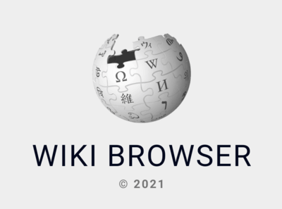
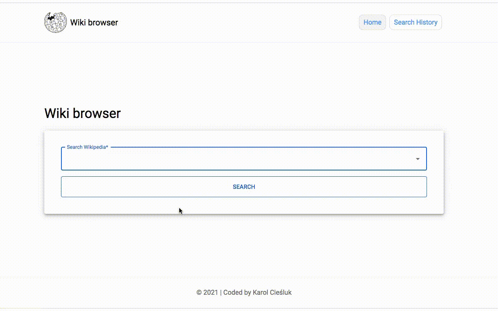
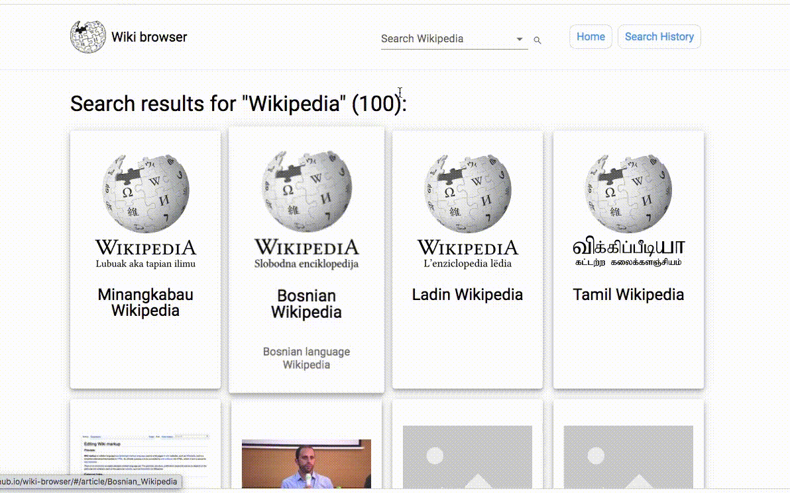
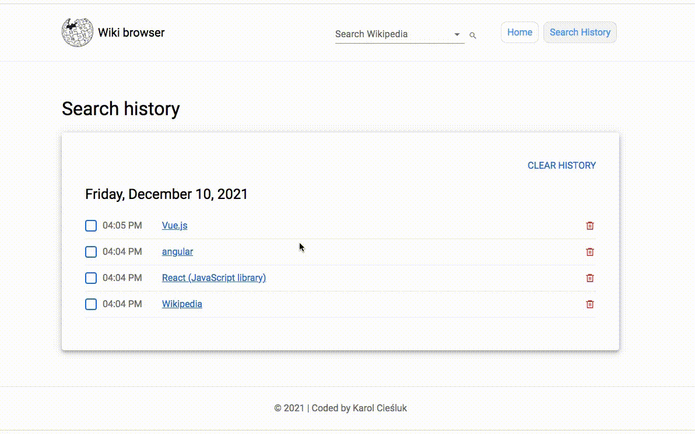

# Wiki Browser

## Table of Contents
1. [Demo](#demo-on-github-pages)
2. [Description](#description)
3. [Technologies](#technologies)
4. [How to use](#how-to-use)
5. [Available Scripts](#available-scripts)

## Demo on Github pages

https://karolciesluk.github.io/wiki-browser/

## Description

The Wiki Browser is an app based on [Media Wiki REST_API](https://www.mediawiki.org/wiki/API:REST_API/Reference) that allows you to search wikipedia articles. Currently only search for articles in english is available.

You have possibility to view:
- List of articles with short description and miniature images.
- Full article with possibility to read it in other language (if available).
- History of recent searches.

The Wiki Browser app was made as a recruitment task for the [Intive Patronage Program](https://intive.com/insights/the-patronage-program).

## Technologies
- HTML
- Javascript ES6
- React.js
- create-react-app
- React Hooks
- Babel
- JSX
- Fetch API
- Web Storage API
- Styled-Components
- Styled-Normalized
- CSS Flexbox
- CSS Grid
- Media Queries
- React Router v6
- React Redux
- Redux-Saga
- Material UI
- Formik
- Yup
- React-icons

Since it's a recruitment task my intention was to show usage of as many technologies as possible and to present the whole spectrum of my abilities and skills.

At the same time I am aware of the fact that it's possible to utilize more simple solutions. Especially I mean usage of React Redux and Redux-Saga technologies. Fetching data from [Media Wiki REST_API](https://www.mediawiki.org/wiki/API:REST_API/Reference) can be done with `useEffect` hook only.

Therefore I've decided to add a little example of how it can be done on branch "fetchWithoutReduxAndSaga" in [src/pages/article](https://github.com/KarolCiesluk/wiki-browser/tree/fetchWithoutReduxAndSaga/src/pages/article) folder.

## How to use

### Searching
There are two search field available. One on the home page and another one you can find on the top bar when you visit other pages.

It's required to type at least one character in order to search for articles.
The input provides suggestions while you type into the field.

### Article List
After successful search you will be directed to articles page on which you may see tiles with article title, short description and miniature images or image placeholder if miniature is not available.

If the list is longer than 12 items it will get divided into smaller parts and pagination controls will show up at the bottom of the page so you can easily navigate between them.

### Article
In order to read chosen article you have to click on article's tile.

Because `html` provided by [Media Wiki REST_API](https://www.mediawiki.org/wiki/API:REST_API/Reference#Get_HTML) has own styling I've decided to use `<iframe />` tag to make sure that the styles don't leak into my app.

Additionally you can switch to other language (if available) by clicking on the language icon next to the article title.

### Search History
If you want to see your search history you have to click on the "History" button which is always in the top right corner of the app.

The history data is saved in the browser local storage.

The page provides you with several buttons so you can control how your search history looks like. You may clear the whole history at once, delete separate items or couple of selected ones.

## Available Scripts

In the project directory, you can run:

### `npm start`

Runs the app in the development mode.\
Open [http://localhost:3000](http://localhost:3000) to view it in the browser.

The page will reload if you make edits.\
You will also see any lint errors in the console.

### `npm run build`

Builds the app for production to the `build` folder.\
It correctly bundles React in production mode and optimizes the build for the best performance.

The build is minified and the filenames include the hashes.\
Your app is ready to be deployed!

See the section about [deployment](https://facebook.github.io/create-react-app/docs/deployment) for more information.

### `npm run eject`

**Note: this is a one-way operation. Once you `eject`, you can’t go back!**

If you aren’t satisfied with the build tool and configuration choices, you can `eject` at any time. This command will remove the single build dependency from your project.

Instead, it will copy all the configuration files and the transitive dependencies (webpack, Babel, ESLint, etc) right into your project so you have full control over them. All of the commands except `eject` will still work, but they will point to the copied scripts so you can tweak them. At this point you’re on your own.

You don’t have to ever use `eject`. The curated feature set is suitable for small and middle deployments, and you shouldn’t feel obligated to use this feature. However we understand that this tool wouldn’t be useful if you couldn’t customize it when you are ready for it.